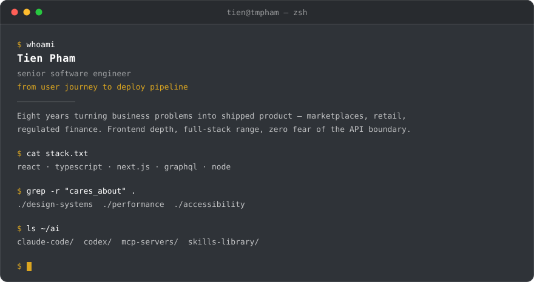

### What I do

- 🚀 &nbsp;**Zero to one.** Idea to shipped product — scoping it, choosing the stack, getting it in front of users.
- 🎯 &nbsp;**Products, not tickets.** I want to know what the thing is for and who it's failing. I own outcomes, not just interfaces.
- 🧱 &nbsp;**Then making it last.** Design systems, performance and accessibility are what keep a v1 from turning into a rewrite.
- 🤖 &nbsp;**AI in the daily loop.** Claude Code and Codex, plus the custom MCP servers and agent tooling I build when off-the-shelf falls short.

### The toolbox

| | |
| --- | --- |
| ⚛️ &nbsp;**core** | React · TypeScript · JavaScript · Next.js |
| 🔌 &nbsp;**state & data** | GraphQL · Apollo · Redux · REST · SQL |
| 🧩 &nbsp;**beyond the frontend** | Node.js · Ruby on Rails |
| 🎨 &nbsp;**styling & design systems** | Tailwind · CSS/SCSS · Emotion · Storybook · design tokens · WCAG |
| 🧪 &nbsp;**testing** | Vitest · Jest · Playwright · Cypress · React Testing Library |
| ☁️ &nbsp;**ci/cd & cloud** | GitHub Actions · Docker · Terraform · AWS · Google Cloud · Vercel |
| 🧠 &nbsp;**ai-assisted dev** | Claude Code · Codex · MCP servers · agent tooling |

<!---
phamik/phamik is a ✨ special ✨ repository because its `README.md` (this file) appears on your GitHub profile.
You can click the Preview link to take a look at your changes.
--->
